<div align="center">
 
 <!-- Dynamic Typing Effect -->
  <div align="center">
    <a href="https://github.com/tarunbisht-24/">
      
    </a>
  </div>

<!-- Knock Code Pictures -->
<br>

### Spotify Playing 🎧


<!-- Profile Logo -->  
  <div align="center">

[](mailto:bishttarun2002@gmail.com "Connect via Email")
[](https://www.linkedin.com/in/tarunbisht24/ "Connect on LinkedIn")
[](https://wa.me/9872779838?text=Hi!)
[](https://www.instagram.com/dumbtarun/)
[](https://t.me/Tarun_Bisht_20BCS6130 "Contact on Telegram")
[](https://twitter.com/intent/follow?screen_name=tarunbisht_24 "Follow on Twitter")
[](https://discordapp.com/users/Bujj#2750/) [](https://open.spotify.com/user/6qhggfwe6s2tmqa0mz5ynmrg6?si=6502513e7c9a4da2)
[](https://www.youtube.com/channel/UCQvMx0IMgE02-gMTN8W4zog)
[](https://github.com/tarunbisht-24/tarunbisht_24/commits)

 
</div>

#  🙋 Hello

<table>
<tr><td>

<!-- About me 关于我 -->
### 🤺 About Me


<p>&emsp;&emsp;Hello everyone, I am Tarun Bisht. </p>
<p>&emsp;&emsp;Love programming, photography, reading, traveling. </p>
<p>&emsp;&emsp;Passionate about computer science and IT and Internet careers, inspired to become an excellent independent developer. </p>
<p>&emsp;&emsp; We are making the world a better place, building a perfect system through code reuse and extension. </p>
<p><strong>&emsp;&emsp;We're making the world a better place. Through constructing elegant hierarchies for maximum code reuse and extensibility.</strong></p>

</td></tr>

<tr><td>

<!-- wakatime 统计 -->
### 📊 WakaTime

<picture>
  <source
    srcset="https://github-readme-stats.vercel.app/api/wakatime?username=sun0225SUN&layout=compact&text_color=f0f6fc&bg_color=00000000&hide_border=true&hide_title=true"
    media="(prefers-color-scheme: dark)"
  />
  <source
    srcset="https://github-readme-stats.vercel.app/api/wakatime?username=sun0225SUN&layout=compact&text_color=1f2328&bg_color=00000000&hide_border=true&hide_title=true"
    media="(prefers-color-scheme: light), (prefers-color-scheme: no-preference)"
  />
  
</picture>

</td></tr>

<tr><td>

<!--START_SECTION:waka-->
**I'm a Night 🦉** 

```text
🌞 Morning                274 commits         █████░░░░░░░░░░░░░░░░░░░░   19.34 % 
🌆 Daytime                428 commits         ████████░░░░░░░░░░░░░░░░░   30.20 % 
🌃 Evening                507 commits         █████████░░░░░░░░░░░░░░░░   35.78 % 
🌙 Night                  208 commits         ████░░░░░░░░░░░░░░░░░░░░░   14.68 % 
```
📅 **I'm Most Productive on Friday** 

```text
Monday                   207 commits         ████░░░░░░░░░░░░░░░░░░░░░   14.61 % 
Tuesday                  187 commits         ███░░░░░░░░░░░░░░░░░░░░░░   13.20 % 
Wednesday                188 commits         ███░░░░░░░░░░░░░░░░░░░░░░   13.27 % 
Thursday                 155 commits         ███░░░░░░░░░░░░░░░░░░░░░░   10.94 % 
Friday                   356 commits         ██████░░░░░░░░░░░░░░░░░░░   25.12 % 
Saturday                 147 commits         ███░░░░░░░░░░░░░░░░░░░░░░   10.37 % 
Sunday                   177 commits         ███░░░░░░░░░░░░░░░░░░░░░░   12.49 % 
```


📊 **This Week I Spent My Time On** 

```text
🕑︎ Time Zone: Asia/Shanghai

💬 Programming Languages: 
Markdown                 8 hrs 2 mins        ██████████░░░░░░░░░░░░░░░   40.46 % 
TypeScript               5 hrs 40 mins       ███████░░░░░░░░░░░░░░░░░░   28.57 % 
Vue.js                   2 hrs 11 mins       ███░░░░░░░░░░░░░░░░░░░░░░   10.99 % 
HTML                     1 hr 27 mins        ██░░░░░░░░░░░░░░░░░░░░░░░   07.33 % 
JSON                     52 mins             █░░░░░░░░░░░░░░░░░░░░░░░░   04.38 % 

🔥 Editors: 
VS Code                  19 hrs 52 mins      █████████████████████████   100.00 % 

💻 Operating System: 
Windows                  18 hrs 17 mins      ███████████████████████░░   92.04 % 
Mac                      1 hr 34 mins        ██░░░░░░░░░░░░░░░░░░░░░░░   07.96 % 
```


 Last Updated on 30/07/2023 01:24:08 UTC
<!--END_SECTION:waka-->
  
</td></tr>
</table>

<!-- ########################################## 分割 ########################################## -->


<div align="center" >



<!-- Just Image -->


<!--  Skill Badge -->

```mermaid
mindmap
  root((小孙同学))
    编程
      Web开发
      网络爬虫
      人工智能
    摄影
      人文
      建筑
      风景
    旅行
      苏州
      南京
      滁州
      合肥
      寿县
    阅读
      人物传记
      个人成长
      社会文化
      心理
      计算机技术
```

💪 Currently Learning: 


<!---->

🧠 Plan to Study:


🧰 Commonly used tools:


<!-- Programming Tool Icon -->
<br>

<!-- svg -->


 


<br>

<!-- gif -->


<!-- just img -->
</div>

<!-- profile-3d-contrib 3D贡献图-->

</div>

<!-- ########################################## 分割 ########################################## -->


<div align="center" >

<!-- Github-Stats-Terminal -->
<br>
  
<!-- Dynamic Quotes -->
<br>
  
<!-- GitHub🏆 -->
<br>

<!-- GitHub -->

<br><br>


# 🚀 Actions

<!-- Record the number of days of continuous code submission -->
<div align="center">
  
  
  
</div>
<br>

<!-- metrics basic information -->
<div align="center"></div>
<br>

<!-- Dynamic Quotes -->
<div align="center"></div>

<!-- GitHub Trophy🏆 -->
<div align="center"></div>

<br>

<!-- GitHub Statistics -->
<div align="center">
  
  
</div>

<br>

<!-- GitHub Activity Graph -->
### <h2 align="center">My Contribution Graph</h2>
<table align="center">
  <tr>
    <td colspan="2">
      
    </td>
  </tr>
</table>

<br>

<!-- wakatime 统计 -->
<table align="center">
<tr>
<td valign="top">  
  
<!--START_SECTION:waka-->

<!--END_SECTION:waka-->
</td>
</tr>
</table>

# 🎯 𝙼𝚎𝚝𝚛𝚒𝚌𝚜

<!-- just img -->
<div align="center"></div>

<!-- plugin metrics -->
<div align="center">
  
</div>


----

<div>
  <h3>Connect with me</h3> 
</div>

<p>Visit my profile and give a ⭐️ if you like it</p>
</div>

⭐️ From [Tarun Bisht](https://github.com/tarunbisht-24)
<br>
<br>

<!-- Snake code contribution diagram -->
<div align="center"></div>


<!-- first form 第一个表格 -->
<table>
  <tr>
    <td></td>
  </tr>
</table>


<!-- second form 第二个表格 -->
<table>
  <tr>
    <td></td>
    <td></td>
  </tr>
  <tr>
    <td></td>
    <td></td>
  </tr>
  <tr>
    <td></td>
    <td></td>
  </tr>
  <tr>
    <td></td>
    <td></td>
  </tr>
  <tr>
    <td></td>
    <td></td>
  </tr>
  <tr>
    <td></td>
    <td></td>
  </tr>
</table>


img width="120%" src="https://repobeats.axiom.co/api/embed/dd42bad8effa7ab44d2f3124414ee110611e044a.svg" />

<!-- just img 图片 -->

</div>
